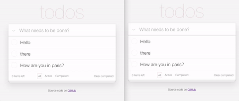

# next-todos
About 200 lines isomorphic todos app powered by [next.js](https://github.com/zeit/next.js/), [redux](https://github.com/reactjs/redux) and [Jet](http://jetbus.io) realtime. 

The todos are synced between browsers.

[](https://todos.now.sh)

The canonical TodoApp using [node-jet](https://github.com/lipp/node-jet) as realtime data backend mechanism. [Jet](https://jetbus.io) uses websockets for fetching/streaming the data and to make changes to the data.
[Redux](https://github.com/reactjs/redux) and [redux-jet](https://github.com/lipp/redux-jet) are used for a clear and simple unidirectional data flow.

[next.js](https://github.com/zeit/next.js/) allows to easily make the server -> client render transition (awesome!!!).

[redux-jet](https://github.com/lipp/redux-jet) hides the stateful nature of the realtime streaming (where differences are pushed over the wire) and helps doing the isomorphic transition with `get` and `fetch` seamlessly.

It's note worthy, that the [redux store](https://github.com/lipp/next-todos/blob/master/store.js#L16) is identical for server and client js code! The only difference is that the store population on the server is triggered by the "finite" [redux-jet `get`](https://github.com/lipp/next-todos/blob/master/store.js#L22) whereas the client issues an "infinite / streaming" [redux-jet `fetch`](https://github.com/lipp/next-todos/blob/master/store.js#L19)

The [components](https://github.com/lipp/next-todos/blob/master/components/) are jet-agnostic. All the jet related stuff is located in [containers dir](https://github.com/lipp/next-todos/blob/master/containers) and [store.js](https://github.com/lipp/next-todos/blob/master/store.js).

# Server

The server source can be found [here](https://github.com/lipp/node-jet/blob/master/examples/todo/todo-server.js) (90 Lines extra). 

# Inspect with Radar

[Radar](https://lipp.github.io/radar/#/) provides another view on the realtime data which is provided by a [Jet Daemon](https://github.com/lipp/node-jet/blob/master/examples/todo/todo-server.js) running on `todos-demo.now.sh`.

Enter this daemon url: `wss://todos-demo.now.sh`

# Developing

```bash
npm run dev
```

# Production

```bash
npm run build
npm start
```

# Not covered

- Authentication / session
- Scaling

# Related

[100 lines of code Hackernews reader](https://github.com/lipp/hackernews) using next.js and graphql.
